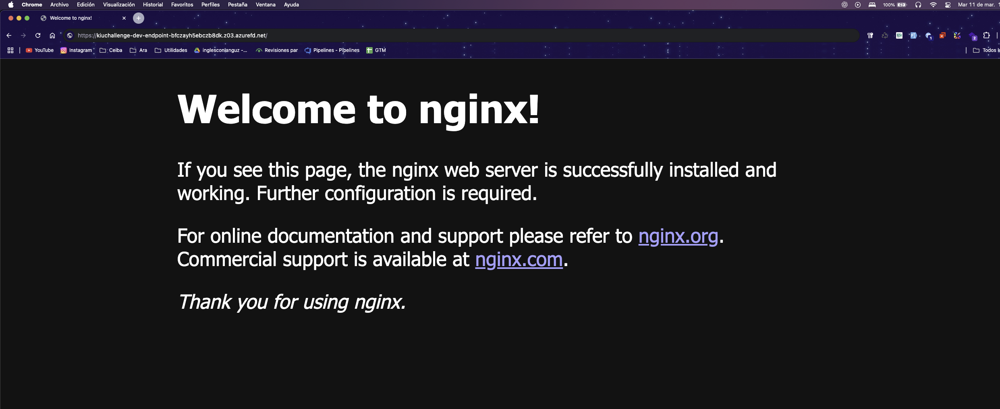

# Proyecto de Infraestructura en Azure con Terraform

Este proyecto configura una infraestructura en Azure utilizando Terraform para desplegar y escalar una aplicación en Kubernetes. Se incluyen recursos como Azure Kubernetes Service (AKS), Azure Front Door y otros componentes necesarios para garantizar disponibilidad, escalabilidad y seguridad.

⚠️ Nota: La infraestructura está apagada para optimizar costos, pero puede ser activada el día de la presentación si es necesario.

## Aclaración sobre la Aplicación CRUD

Por temas de tiempo, no se pudo desarrollar una pequeña aplicación CRUD funcional. Sin embargo, se adjunta una imagen del servicio desplegado para evidenciar el correcto funcionamiento de la infraestructura.




### Componentes Principales

- **Kubernetes Cluster (AKS)**: Aloja la aplicación y garantiza escalabilidad.
- **Azure Front Door**: Proporciona balanceo de carga global y enrutamiento seguro.
- **Base de Datos Escalable**: Se despliega con alta disponibilidad y capacidad de manejar múltiples usuarios
  concurrentes.
- **Automatización con Terraform**: Toda la infraestructura se crea y administra con Terraform.

## Estructura del Proyecto

- `infra/`: Contiene la configuración de infraestructura.
    - `modules/`: Módulos reutilizables de Terraform.
    - `envs/`: Configuraciones específicas de cada entorno (dev, prod, etc.).
- `app/`: Contiene la configuración de despliegue de aplicaciones.
    - `deploy/`: Archivos de despliegue para Kubernetes.

## Prerrequisitos

- [Terraform](https://www.terraform.io/downloads.html) instalado.
- [Azure CLI](https://docs.microsoft.com/en-us/cli/azure/install-azure-cli) instalado.
- Una cuenta de Azure con permisos para crear recursos.

## Configuración Inicial

1. Clonar el repositorio:
    ```sh
    git clone <URL_DEL_REPOSITORIO>
    cd <NOMBRE_DEL_REPOSITORIO>
    ```

2. Configurar las variables necesarias en `terraform.tfvars`:
    ```hcl
   tf_state_config = {
      storage_account_name = "kiustate"
      container_name       = "tfstate"
      key                  = "dev.terraform.tfstate"
      resource_group_name  = "tfstate-rg"
    }
    ```

3. Asegúrate de agregar el `SUBSCRIPTION_ID` en el `Makefile`:
    ```makefile
    SUBSCRIPTION_ID="tu_subscription_id"
    ```

## Comandos Makefile

El `Makefile` incluye varios comandos útiles para gestionar la infraestructura:

- `check-tools`: Verifica que las herramientas necesarias están instaladas.
- `create-rg`: Crea el Resource Group si no existe.
- `create-storage`: Crea la Storage Account si no existe.
- `create-container`: Crea el contenedor en la Storage Account.
- `initialize-state`: Inicializa el backend de Terraform.
- `terraform-init`: Inicializa Terraform.
- `terraform-validate`: Valida la sintaxis de los archivos de Terraform.
- `terraform-plan`: Genera el plan de infraestructura.
- `terraform-apply`: Aplica el plan de infraestructura.
- `terraform-destroy`: Destruye la infraestructura.
- `terraform-output`: Obtiene las salidas de Terraform.

## Despliegue de la Aplicación

1. Inicializar Terraform:
    ```sh
    make terraform-init
    ```

2. Validar la sintaxis de los archivos de Terraform:
    ```sh
    make terraform-validate
    ```

3. Generar el plan de infraestructura:
    ```sh
    make terraform-plan
    ```

4. Aplicar el plan de infraestructura:
    ```sh
    make terraform-apply
    ```

5. Desplegar la aplicación en Kubernetes:
    ```sh
    kubectl apply -f app/deploy/deploy.dev.yaml
    ```

## Salidas

Las salidas de Terraform se pueden obtener ejecutando:

```sh
make terraform-output
 ```
